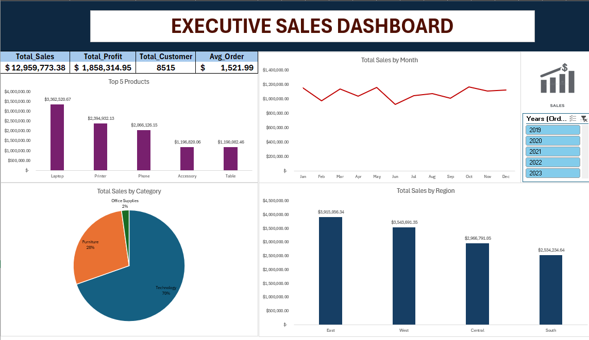

# 📊 Executive Sales Dashboard (Excel)

## 📷 Dashboard Preview

## 🎯 Project Overview

An interactive Excel dashboard analyzing **$12.96M in sales** across **8,515 customers** over multiple years. Built using Pivot Tables, advanced formulas, and dynamic slicers to provide executives with real-time business insights.

**Live Dashboard:** [Download Excel File](Sales_Dashboard.xlsx)

---

## 📈 Key Metrics

| Metric | Value |
|--------|-------|
| **Total Sales** | $12,959,773.38 |
| **Total Profit** | $1,858,314.95 |
| **Total Customers** | 8,515 |
| **Average Order Value** | $1,521.99 |
| **Profit Margin** | 14.3% |

---

## 🔍 Dashboard Features

### Interactive Elements
- **Year Filter Slicer**: Filter all charts by year (2019-2023)
- **Dynamic KPI Cards**: Auto-update based on selected year
- **5 Connected Visualizations**: All charts respond to slicer selection

### Visualizations

#### 1. **Top 5 Products (Bar Chart)**
- Laptop: $3.36M
- Printer: $2.39M
- Phone: $2.07M
- Accessory: $1.20M
- Table: $1.19M

**Insight**: Top 3 products account for 60% of total revenue

#### 2. **Monthly Sales Trend (Line Chart)**
- Clear seasonality patterns visible
- Peak sales periods identifiable
- YoY comparison enabled via slicer

#### 3. **Sales by Category (Pie Chart)**
- Technology: 70%
- Furniture: 28%
- Office Supplies: 3%

**Insight**: Heavy dependence on Technology category

#### 4. **Sales by Region (Bar Chart)**
- East: $3,915,066.34 (30%)
- West: $3,543,691.33 (27%)
- Central: $2,966,794.95 (23%)
- South: $2,534,234.64 (20%)

**Insight**: Relatively balanced regional distribution

---

## 💡 Key Business Insights

### 1. **Technology Category Dominance**
- 70% of revenue comes from Technology products
- **Risk**: Over-reliance on single category
- **Recommendation**: Diversify product portfolio or double-down on tech leadership

### 2. **Top Product Concentration**
- Top 5 products = 80% of total sales
- Laptop alone accounts for 26% of revenue
- **Recommendation**: Protect supply chain for these critical SKUs

### 3. **Regional Performance**
- East region leads but only by 10% vs. lowest region
- No region underperforming significantly
- **Recommendation**: Investigate East's success factors for replication

### 4. **Customer Base Analysis**
- Average order value of $1,522 indicates B2B or high-ticket items
- With 8,515 customers and $13M sales, strong repeat purchase behavior
- **Recommendation**: Implement customer retention program

### 5. **Office Supplies Underperformance**
- Only 3% of sales despite being a category
- **Recommendation**: Either invest in this category or discontinue low performers

---

## 🛠️ Technical Skills Demonstrated

### Excel Proficiency
- ✅ **Pivot Tables**: Multi-dimensional analysis with ROWS, COLUMNS, VALUES, FILTERS
- ✅ **Advanced Formulas**: SUMIF, COUNTIF, AVERAGEIF, nested IF statements
- ✅ **Data Visualization**: Bar charts, line charts, pie charts with proper formatting
- ✅ **Slicers**: Interactive filtering across multiple Pivot Tables
- ✅ **Dashboard Design**: Professional layout, color scheme, and KPI card design
- ✅ **Data Validation**: Ensuring chart accuracy and formula correctness

### Business Analysis Skills
- ✅ Metric selection (Sales, Profit, Customer count, AOV)
- ✅ Segmentation analysis (by Product, Category, Region, Time)
- ✅ Insight generation from data patterns
- ✅ Executive-level communication

---

## 🚀 How to Use

1. **Download** the Excel file
2. **Enable editing** if Excel shows a security warning
3. **Use the Year slicer** (top right) to filter by specific year
4. **Watch all charts update** automatically
5. **Analyze trends** across different time periods

### System Requirements
- Microsoft Excel 2016 or later (Windows/Mac)
- Recommended: Excel 365 for best compatibility

---

## 📊 Data Source

**Dataset**: Sample Superstore Sales Data  
**Records**: 8,515+ customer transactions  
**Time Period**: 2019-2023  
**Categories**: Technology, Furniture, Office Supplies  
**Regions**: East, West, Central, South  

---

## 🎓 Learning Outcomes

This project demonstrates proficiency in:
- Building executive-level dashboards from scratch
- Using Pivot Tables for multi-dimensional analysis
- Creating interactive elements (slicers) for data exploration
- Designing clean, professional visualizations
- Extracting actionable business insights from sales data
- Communicating findings to non-technical stakeholders

---

## 📞 Contact & Portfolio

**Created by**:Mohammad Riyazuddin
**Email**: riyazuddinnmohammad@gmail.com
**LinkedIn**:www.linkedin.com/in/riyaz-mohammad-129b7b2b5 

**Other Projects**:
- [E-Commerce SQL Analysis](link-to-sql-project)
- [Python Data Cleaning Pipeline](link-to-python-project)

---

## 🙏 Acknowledgments

- Dataset: Sample Superstore (commonly used for learning data analysis)
- Inspiration: Real-world business intelligence dashboards
- Tools: Microsoft Excel 365

---

**⭐ If you found this project helpful, please star this repository!**

---

*Last Updated: February 2026*

